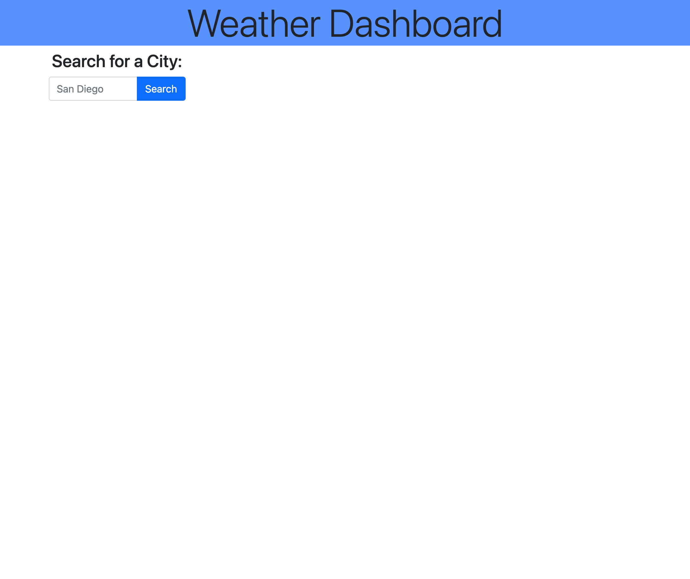
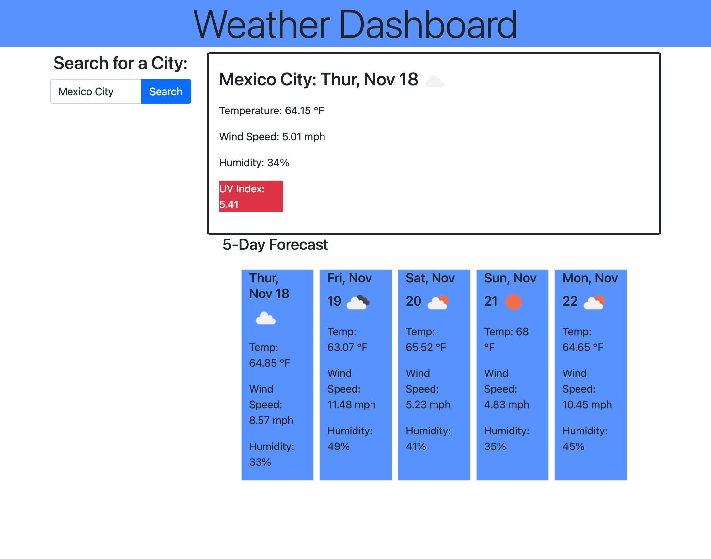
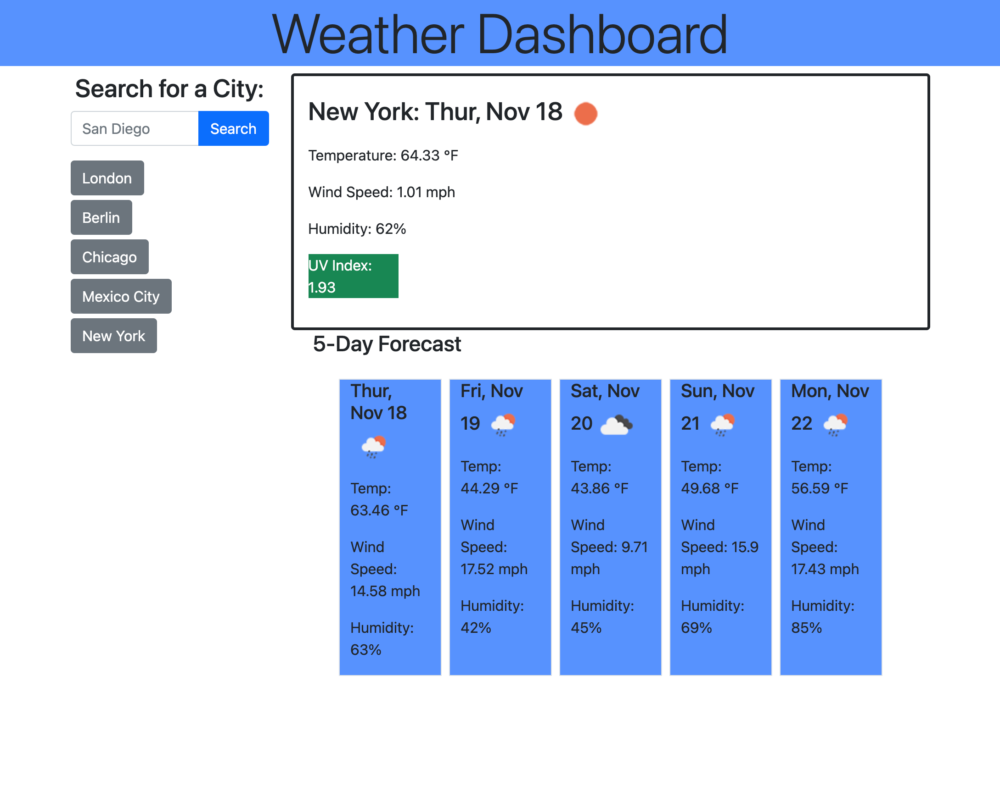

# 06.Server-Side APIs Challenge: Weather Dashboard

## Description

A weather dashboard showing 5-day data for a chosen location. User can imput location to see today's date, temperature, wind speed, humidity, and UV index. User will also see date, temperature, wind speed, and humidity for the next five days. The dashboard saves user searches to localStorage and dynamically creates buttons below the search bar for the user to click, for ease of retrieving previous searches.

## Table of Contents

- [Links](#links)
- [Usages](#usages)
- [User Story](#user-story)
- [Acceptance Criteria](#acceptance-criteria)
- [Resources](#resources)
- [Contribution](#contribution)

## Links

- [GitHub Repo](https://github.com/a-breezy/06.Weather-App)
- [Live URL](https://a-breezy.github.io/06.Weather-App/)

## Usages

## User Story

AS A traveler
I WANT to see the weather outlook for multiple cities
SO THAT I can plan a trip accordingly

## Acceptance Criteria

GIVEN a weather dashboard with form inputs
WHEN I search for a city
THEN I am presented with current and future conditions for that city and that city is added to the search history
WHEN I view current weather conditions for that city
THEN I am presented with the city name, the date, an icon representation of weather conditions, the temperature, the humidity, the wind speed, and the UV index
WHEN I view the UV index
THEN I am presented with a color that indicates whether the conditions are favorable, moderate, or severe
WHEN I view future weather conditions for that city
THEN I am presented with a 5-day forecast that displays the date, an icon representation of weather conditions, the temperature, the wind speed, and the humidity
WHEN I click on a city in the search history
THEN I am again presented with current and future conditions for that city

## Resources

- [Bootstrap](https://getbootstrap.com/)
- [jQuery](https://jquery.com/)
- [OpenWeather](https://openweathermap.org/)

## Contribution

Made with ❤️ by a-breezy
Logical help from @andrewyu22
